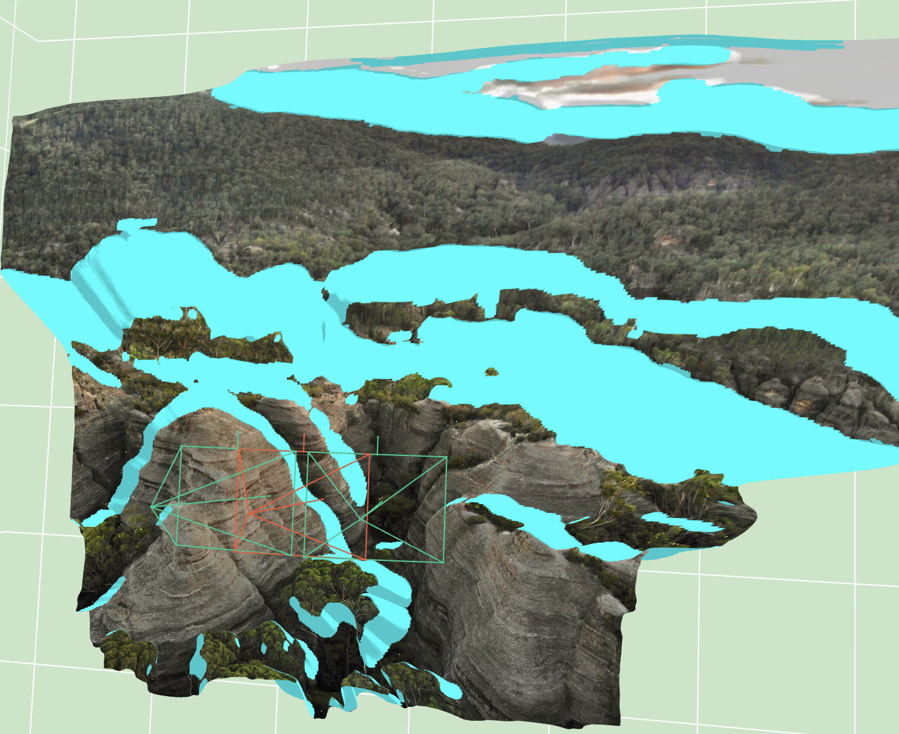

# Interactive Images

[](https://opensource.org/licenses/MIT) 

While browsing on LinkedIn I came across [a demo from Cinemersive Labs](https://www.linkedin.com/feed/update/urn:li:activity:7209214244821577731/) showing 3D six-degrees-of-freedom photographs created from single photo shots.
Wanting to make an intro towards generative 3D, this repo will attempt to follow a similar idea to create interactive scenes from a single (or more) image.

## Quickstart
### Package Installation
```bash
conda create -n interactive_images python==3.11
conda activate interactive_images

pip install -r requirements.txt
pip install git+https://github.com/facebookresearch/pytorch3d.git@stable
pip install -e .
```

### Development (recommendation)
The project includes docker and docker-compose files for easy setup and a .devcontainer configuration folder for use in VSCode that also auto-installs extensions and sets up workspace settings.

I recommend using Visual Studio Code (VS Code) with the Remote Development extension to work on this project. This allows you to open the project as a container and have all dependencies automatically set up.

To use VS Code, follow these steps:

1. Open VS Code.
2. Install the Remote Development extension if you haven't already.
3. Press Ctrl/Cmd + Shift + P and select "Dev Containers: Open Folder in Container..." from the command palette.
4. Wait for the container to set up and start development.

## Current State
1. **Image to rough mesh**

    Using a depth detector, we project each image pixel into the 3D space and create a mesh. We filter faces with very large edges (streched) and also "dilate" them to further reduce stretch artifacts. Bellow you can see an example of a mesh together with the capture camera (in red) and the rendering cameras (in green).

    

2. **Mesh to multiview renders**

    By creating a circular set of cameras around the capture camera, we render the mesh from multiple views.


## TODO
- [x] Find out why the outputs from of [ZoeDepth](https://github.com/isl-org/ZoeDepth) from the original repo are different that the one from the [🤗 implementation](https://huggingface.co/docs/transformers/v4.43.4/en/model_doc/zoedepth) (+fix). Track the updates in [this issue on 🤗 Transformers](https://github.com/huggingface/transformers/issues/32381).
- [x] Begin by cloning the "Image to 3D" tab functionality of the [ZoeDepth 🤗 demo](https://huggingface.co/spaces/shariqfarooq/ZoeDepth).
- [x] Understand "intrinsic and extrinsic camera parameters" and how to use them in 3D a bit better.
- [x] Render images from 3D mesh.
- [x] Use [Pytorch3D](https://pytorch3d.org/) whenever possible.
- [x] Finish cleaning up `Image_to_3D` notebook and complete transition to scripts for main functionality.
- [ ] Test [GeoCalib](https://github.com/cvg/GeoCalib) for focal estimation.
- [ ] Test [3D-Photo-Inpainting](https://github.com/vt-vl-lab/3d-photo-inpainting/tree/master) for context-aware depth inpainting
- [ ] Fill missing parts of the image using Stable Diffusion or other similar generative model.
- [ ] Probably also use a depth control net for the generated images.
- [ ] Could/should we use a video generation model instead?
